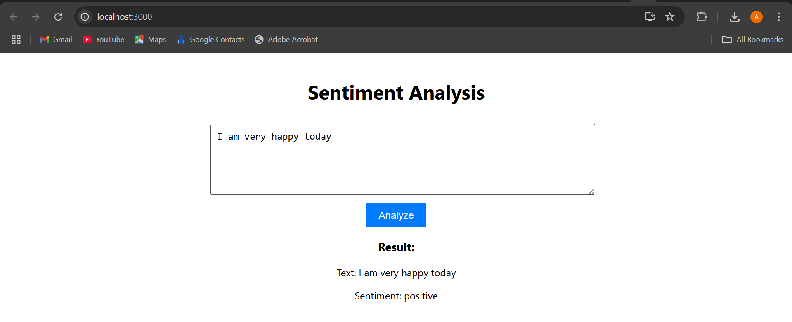
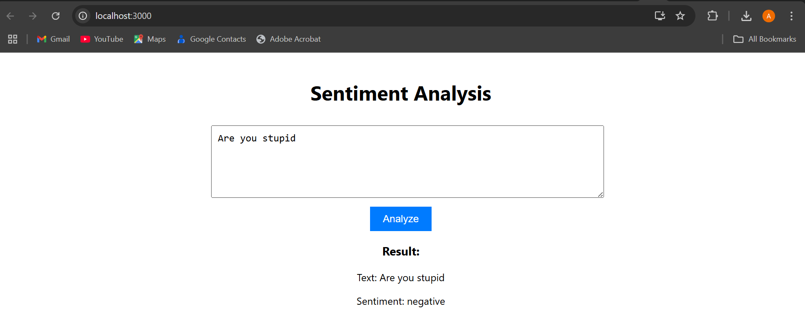

# 🎯 Text-Based Sentiment Analysis with NLP & Machine Learning

Welcome to **Text-Based Sentiment Analysis**, a powerful and interactive web app that analyzes text and predicts whether it's **Positive** 😊 or **Negative** 😡 using state-of-the-art **Natural Language Processing (NLP)** and **Machine Learning (ML)** techniques.

Built with ❤️ using **Python (Flask)** and **React**, this project features end-to-end functionality — from data preprocessing and model training to a slick user-friendly interface.

---

## 🚀 Features

- 🧹 **Smart Preprocessing** – Removes URLs, mentions, special characters, stop words, and applies lemmatization.
- 🤖 **Robust Model** – Trains a **Support Vector Machine (SVM)** using **TF-IDF** features for accurate sentiment classification.
- 🖥️ **Web Interface** – React-based frontend to input text and visualize sentiment predictions in real-time.
- ⚠️ **Edge Case Handling** – Gracefully manages empty inputs and `NaN` values.

---

## 📂 Dataset

We use the widely known **Sentiment140** dataset with 1.6 million labeled tweets.

🔗 [Download on Kaggle → Sentiment140 Dataset](https://www.kaggle.com/kazanova/sentiment140)

📁 After downloading, rename and place the file as:
\`\`\`
data/sentiment140.csv
\`\`\`

---

## 🧱 Project Structure

```
sentiment_analysis_project/
├── src/
│   ├── preprocessing.py       # Preprocess the dataset
│   ├── train.py               # Train the SVM model
│   └── app.py                 # Flask backend for predictions
├── frontend/
│   ├── src/
│   │   ├── App.js             # React frontend logic
│   │   └── App.css            # Frontend styling
│   └── package.json           # Frontend dependencies
├── images/
│   ├── positive_sentiment.png
│   └── negative_sentiment.png
├── requirements.txt           # Python dependencies
└── README.md
```

---

## ⚙️ Setup Instructions

### 📌 Prerequisites
- ✅ Python 3.8+
- ✅ Node.js & npm
- ✅ Git

### 💻 Installation Steps

1. **Clone this repo**:
\`\`\`bash
git clone https://github.com/yourusername/Text-Based-Sentiment-Analysis.git
cd sentiment_analysis_project
\`\`\`

2. **Set up Python virtual environment**:
\`\`\`bash
python -m venv venv
# Windows
.\venv\Scripts\activate
# macOS/Linux
source venv/bin/activate
pip install -r requirements.txt
\`\`\`

3. **Download NLTK resources**:
\`\`\`python
import nltk
nltk.download('punkt')
nltk.download('stopwords')
nltk.download('wordnet')
\`\`\`

4. **Install frontend dependencies**:
\`\`\`bash
cd frontend
npm install
\`\`\`

5. **Download and prepare the dataset**:
- Download: \`training.1600000.processed.noemoticon.csv\`
- Save as: \`data/sentiment140.csv\`

6. **Preprocess the dataset**:
\`\`\`bash
python src/preprocessing.py
\`\`\`

7. **Train the SVM model**:
\`\`\`bash
python src/train.py
\`\`\`

---

## ▶️ Running the App

### 🔙 Start the Flask Backend
\`\`\`bash
python src/app.py
\`\`\`
Runs on: \`http://127.0.0.1:5000\`

### 🔜 Start the React Frontend
\`\`\`bash
cd frontend
npm start
\`\`\`
Runs on: \`http://localhost:3000\`

---

## 🌐 Usage

1. Open your browser at \`http://localhost:3000\`
2. Type a sentence like:  
   \`"I love this movie!"\` 🎬  
   or  
   \`"I am not happy about this."\` 😞
3. Hit **Analyze** and watch the magic happen ✨  
   You'll see the **sentiment** !

---

## 🖼️ Example Snapshots

### ✅ Positive Sentiment


### ❌ Negative Sentiment


---

## 🛠️ Tech Stack

| Area         | Tech                                   |
|--------------|----------------------------------------|
| 💡 Backend   | Python, Flask, scikit-learn, NLTK       |
| 🎨 Frontend  | React, JavaScript                      |
| 📊 Dataset   | Sentiment140 from Kaggle               |

---

## 🌱 Future Improvements

- 🤔 Detect sarcasm, irony, or nuanced emotions
- 📊 Add sentiment distribution visualizations (Chart.js)
- ☁️ Deploy to **Heroku** (backend) and **Netlify** (frontend)
- 🧠 Try other models like **BERT** or **GRU**

---

## 📝 License

Licensed under the [MIT License](LICENSE).

---

## 💬 Contributing

Found a bug 🐞? Have a suggestion 💡?  
Feel free to [open an issue](https://github.com/yourusername/sentiment-analysis/issues) or submit a PR!  
Let’s make sentiment smarter — together!

---

> Built with ☕ and 💻 by [ADEMOLA, Akorede A.](https://github.com/yourusername)
EOF
